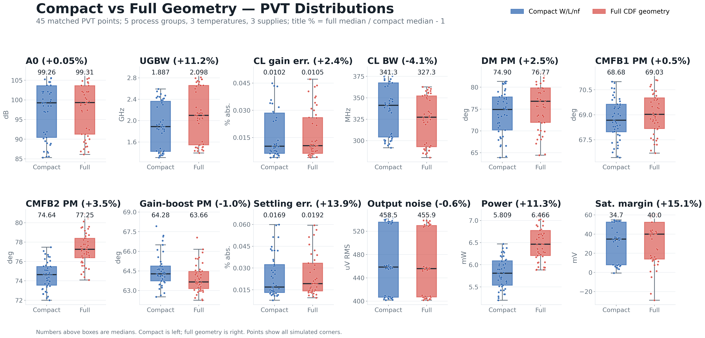

# 001 - Fully Differential MDAC OTA

This directory is a self-contained transistor-level reference design for a
fully differential, two-stage OTA intended for a 14-bit pipeline-ADC MDAC.
It includes two electrically compatible DUT netlists and shared standalone
Spectre testbenches for AC, stability, noise, operating-point, and
residue-settling verification.

- `ota_core.scs`: compact W/L/multi/nf representation.
- `ota_core_full_geometry.scs`: Virtuoso/CDF-generated representation with
  explicit diffusion, resistance-geometry, spacing, stress, and proximity
  fields for all 67 MOS devices.

Both files define the same `ota_core` subcircuit and port order. Include only
one DUT file in a simulation. The full-geometry version is the recommended
default because it reproduces the Cadence schematic netlist. It is not a
post-layout RC/PEX netlist.

## Requirements

- Cadence Spectre 21.1 or a compatible newer release.
- A licensed TSMC 28 nm PDK containing `nch_ulvt_mac` and `pch_ulvt_mac`.
- Bash for `run-spectre.sh`.

The proprietary PDK and its model files are not distributed in this repository.

## Set the PDK path

Edit the five `include` statements near the top of both `tb_ac.scs` and
`tb_tran.scs`. Replace only the path inside quotation marks:

```spectre
include "/path/to/your/TSMC28_PDK/models/spectre/crn28ull_1d8_elk_v1d8_2p2_shrink0d9_embedded_usage.scs" section=pre_simu
```

Use the master Spectre model deck from your PDK revision. It must define the
`pre_simu`, `noise_worst`, `TTMacro_MOS_MOSCAP`,
`TT_RES_BIP_DIO_DISRES`, and `TT_MOM` sections.

## Run

Load the Cadence environment so that `spectre` is available in `PATH`, then:

```bash
./run-spectre.sh ac full
./run-spectre.sh tran full
```

The defaults are the full-geometry DUT and Spectre X `cx`. Select the compact
DUT or another solver mode explicitly when needed:

```bash
./run-spectre.sh ac simple cx
./run-spectre.sh tran full aps
./run-spectre.sh ac full ax
```

Results are written below `results/<analysis>_<variant>_<mode>/` and are
excluded from Git. The committed reference condition is TT, 27 C, and 0.9 V.

## Compact versus full geometry

Both netlists were simulated with the same model sections, testbenches, solver
settings, and loading. In every panel below, compact W/L/nf is on the left and
full schematic CDF geometry is on the right. The percentage in each panel title
is the full-geometry median relative to the compact median.



The PVT comparison contains the complete matched 45-point matrix for both
netlists: five MOS process groups, three temperatures, and three supply
voltages. Each dot is one simulated PVT point; each box summarizes the
corresponding distribution.

These figures compare two schematic device descriptions. The full-geometry
netlist contains complete Virtuoso/CDF geometry fields, but neither netlist
contains extracted interconnect resistance or capacitance. It must not be
interpreted as a post-layout PEX result. Exact values can vary with PDK revision
and simulator version.

## DUT ports

```spectre
subckt ota_core (vdd vss in_p in_n out_p out_n i_bias reset)
```

`i_bias` accepts a 20 uA reference current. `reset` is active high.
